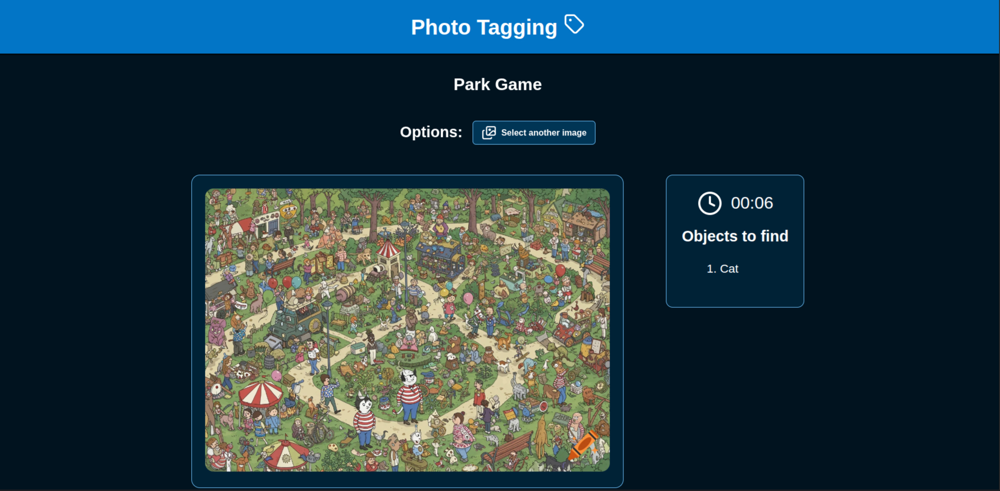

# Photo Tagging

## Overview

This web app is inspired in the Where's Waldo game. The app allows you to:

Just like the original version of Where's Waldo, the goal is to find specific object within an image and this app keeps track of how long it takes you to find them.

**[Check it here](https://cesar-a-delacruz-photo-tagging.netlify.app)**

## Main Features

1. Upload, edit and delete images
2. Select, edit and delete objects in an image
3. Keep a score based on the time it takes you to find all objects in a selected image
4. Reset the record on a specific image or delete all your data
